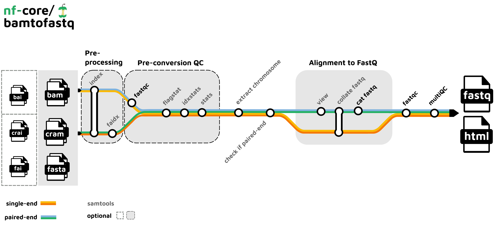

# A Brief View on Nextflow

Nextflow is a powerfull pipelining tool that allows reproducible and efficent processing of bioinformatic datasets. Specifically, some advantages:

- Standardises the inputs & outputs between pipeline stages
- Can process files simultaneously through pipelines
- Can manage submission to queueing systems

## A basic nextflow script

With nextflow already installed (see here), it is simple to run a script. Lets start with this simple script. 

It has one parameter: ```str```, and two processes: ```splitGeneList``` & ```convertToUpper```

At the end it has the workflow, which will look familiar to bash scripting where it uses pipes to pass between each process.

Lets look closer at what's going on:
```
params.str = 'AATT'

process splitGeneList {
    output:
    path 'chunk_*'

    shell:
    """
    IFS=',' read -ra SPLIT_LIST  <<< "${params.str}"

    # Loop through each item in the list and output them as chunks
    for i in \${!SPLIT_LIST[@]}
    do
        echo \${SPLIT_LIST[\$i]} > chunk_\$((i+1))
    done
    """
}

process convertToUpper {
    input:
    path x

    output:
    stdout

    """
    cat $x | tr '[a-z]' '[A-Z]'
    """
}

workflow {
    splitGeneList | flatten | convertToUpper | view { it.trim() }
}
```

## Runnning a nextflow script file
Copy the file from the ```~/Shared_folder/nextflow/nextflow_gene_lister.nf``` (this file has some extra parts than the shorter version seen above, that we will use further down this page)

We can now run the script:
```
nextflow run nextflow_gene_lister.nf
N E X T F L O W  ~  version 23.10.1
Launching `nextflow_gene_lister.nf` [suspicious_picasso] DSL2 - revision: 74255f5b09
executor >  local (3)
[74/298d81] process > splitGeneList      [100%] 1 of 1 ✔
[00/315642] process > convertToUpper (1) [100%] 1 of 1 ✔
```
Each process is listed and the pipeline was ran with default parameter. 

Now lets give it some more data. Any parameter can be changed from the command line when running using ```--``` and the parameter name. Let's give it multiple genes:

```
nextflow run nextflow_gene_lister.nf --str \
"GTCTgggggATCTcccCTGACGT,AAAAATGCTATAAAAGCCCTTTTGCTGGGG,TTGCATGCTACGGGTCATGGTCGGAAAAAATTTGCaaaaaaaaaa,atgGTCAGTCATGCATGCTA"
```
As you see in the output, there are 4 processes in convertToUpper, as each split gene has been turned into it's individual item.
```
[88/1b102a] process > splitGeneList      [100%] 1 of 1 ✔
[01/0f688d] process > convertToUpper (4) [100%] 4 of 4 ✔
TTGCATGCTACGGGTCATGGTCGGAAAAAATTTGCAAAAAAAAAA
GTCTGGGGGATCTCCCCTGACGT
AAAAATGCTATAAAAGCCCTTTTGCTGGGG
ATGGTCAGTCATGCATGCTA
```
Lets look at the ```work``` folder to see what's going on with out processing...

## Resuming 
Sometimes processes will go wrong or break for reasons such as ran out of memory, or a bug in one process. Fortunately you don't need to go all the way from the beginning again, and the ```-resume``` flag allows nextflow to decide which steps need to be ran, and which have been completed.

In the script you copied, there is also an additional function: ```ATCalc```. This calls an outside program named ```AT_pc_calc.py``` to calculate the AT% of each gene. Plus it demonstrates how easy it is to call outer packages.

Lets look at what has changed.
```
process ATCalc {
    input:
    val gene

    output:
    stdout

    """
    python /home/ubuntu/Shared_folder/nextflow/AT_pc_calc.py $gene
    """
}

workflow {
    splitGeneList | flatten | convertToUpper | view { it.trim() }

    //Uncomment to run the AT calculation process using the output from convertToUpper
    //ATCalc(convertToUpper.out) | view { it.trim() }
}
```

Lets uncomment the call to ATCalc, and run the nextflow script again, but this time using the ```-resume``` parameter.
```
nextflow run nextflow_gene_lister.nf --str "GTCTgggggATCTcccCTGACGT,AAAAATGCTATAAAAGCCCTTTTGCTGGGG,TTGCATGCTACGGGTCATGGTCGGAAAAAATTTGCaaaaaaaaaa,atgGTCAGTCATGCATGCTA" -resume
~~~~~
[88/1b102a] process > splitGeneList      [100%] 1 of 1, cached: 1 ✔
[5d/cdfbae] process > convertToUpper (3) [100%] 4 of 4, cached: 4 ✔
[3a/71c5b0] process > ATCalc (1)         [100%] 4 of 4 ✔
```
Notice how the first two steps (which were completed before we added the extra function) were 'cached', so they weren't processed again. Can be a big time saver!

## Using containers in nextflow
You can instruct your pipeline to use singularity, docker, conda or several other instalation methods. That allows you to specify a codeblock such as this, often in a config file.

Here, any process labelled 'trimming' will use the container as found on dockerhub:
```
  withLabel: trimming {
     container = 'staphb/fastp:0.23.4'
  }
```

## Running a published pipeline & using containers
Many professional and complex pipelines are published on nf-core, and many groups and individuals publish their own on github that you can directly reference. 

Here lets use a bam to fastq converter. Here's the pipeline from [nf-core/bamtofastq](https://nf-co.re/bamtofastq/2.1.0).



This is defined to use singularity for all programmes (no installations required!). Note I have limited the cpu and memory usage for this tutorial.
```
nextflow run nf-core/bamtofastq -r 2.1.0 \
    -profile singularity \
    --input bam_samplesheet.csv \
    --outdir bc2fq_output \
    --max_cpus 2 \
    --max_memory 8.GB
```

In this case, it is accessing the code from the nf-core repository, however often you'll want to download it and edit the configuration files yourself. That can be done with the clone command, and then the pipeline ran as above:
```
nextflow clone nf-core/bamtofastq
~~~~~~~
cd bamtofastq
nextflow run main.nf ...............
```

### The end!
This was a very quick and simple overview of the nextflow pipeline system and how to get started using it. It can be complext to start writing your own at first, but with the amount of published pipelines there are a lot of resources to lean on. Good luck!